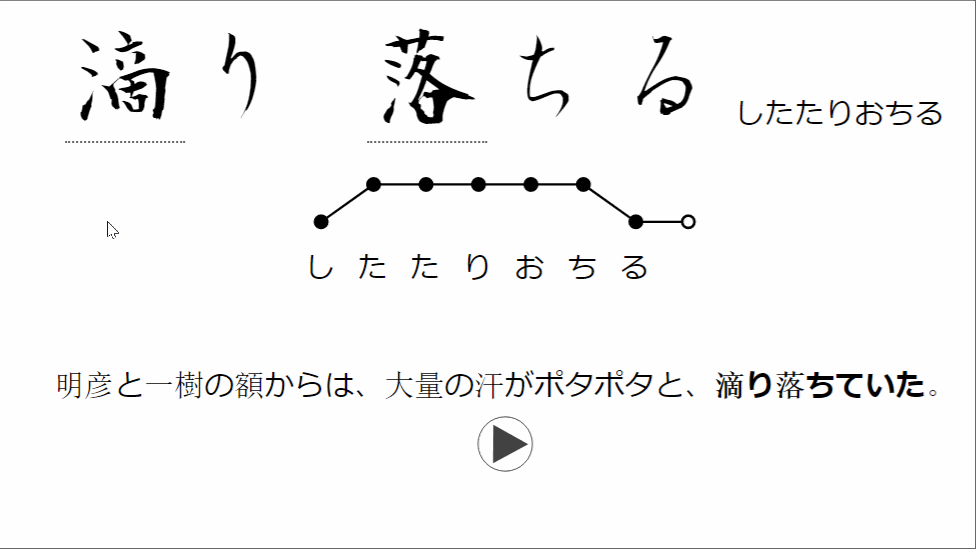

# anki-kakijun

[](https://ankiweb.net/shared/info/1250448937)
[](https://github.com/psf/black)

Kanji stroke order add-on for Anki (beta version)

## Usage 

Go to Tools > Manage Note Types > Select your note type > Cards (on the right side)

Add the **kakijun** filter to your card templates :

```html
{{kakijun:field-name}}
```

## Example 



## References

This project is based on those wonderful opensource projects :

+ [kanimaji](https://github.com/maurimo/kanimaji)
+ [KanjiVG](https://github.com/KanjiVG/kanjivg)

## Licensing

The source code of this add-on is released under the MIT License.

The SVG images located in the [kanjisvg folder](https://github.com/midse/anki-kakijun/blob/master/kanjisvg) are released under the <a rel="license" href="http://creativecommons.org/licenses/by-sa/4.0/">Creative Commons Attribution-ShareAlike 4.0 International License</a>. 

<a rel="license" href="http://creativecommons.org/licenses/by-sa/4.0/"></a>